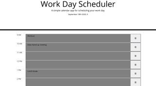

# Workday Scheduler

GWU Full Stack Project: 

Third-Party APIs: Work Day Scheduler

Create a simple calendar application that allows the user to save events for each hour of the day. This app will run in the browser and feature dynamically updated HTML and CSS powered by jQuery.
You'll need to use the Moment.js library to work with date and time. Be sure to read the documentation carefully and concentrate on using Moment.js in the browser.

Table of contents:

1. Quick start
2. User Story
3. Acceptance Criteria
5. Project description
4. Creators


## Quick start
1. Clone the repo: https://gw.bootcampcontent.com/GW-Coding-Boot-Camp/gwu-arl-fsf-pt-08-2020-u-c.git
2. Pull the latest code version


## User Story
```
AS AN employee with a busy schedule
I WANT to add important events to a daily planner
SO THAT I can manage my time effectively

```


## Acceptance Criteria
```
GIVEN I am using a daily planner to create a schedule
WHEN I open the planner
THEN the current day is displayed at the top of the calendar
WHEN I scroll down
THEN I am presented with timeblocks for standard business hours
WHEN I view the timeblocks for that day
THEN each timeblock is color coded to indicate whether it is in the past, present, or future
WHEN I click into a timeblock
THEN I can enter an event
WHEN I click the save button for that timeblock
THEN the text for that event is saved in local storage
WHEN I refresh the page
THEN the saved events persist

```

## Project description


This workday scheduler allows user to save the daily schedule. Also, base on the current time, each timeblock is color coded to indicate whether it is in the past(shows grey color), present(shows red color), future(shows green color). 

## Creators

Project created by: Venus Hu 

Github: 
https://github.com/Venus1001/Work-Day-Scheduler.git